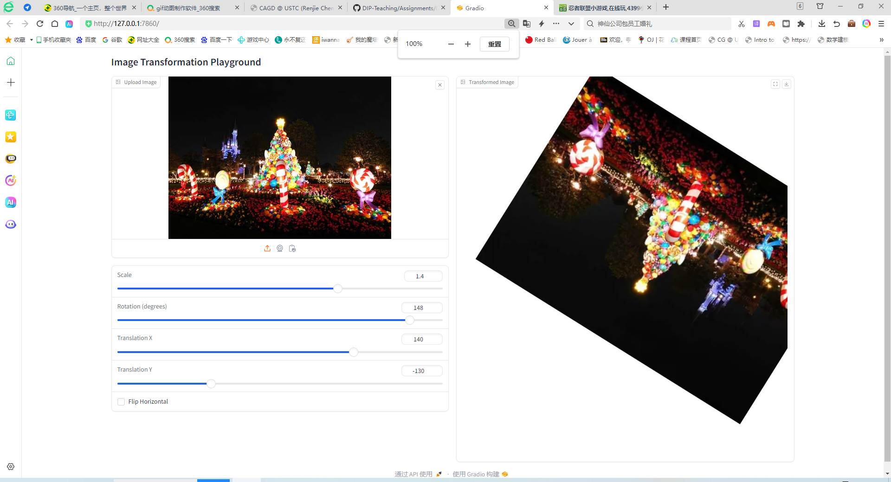
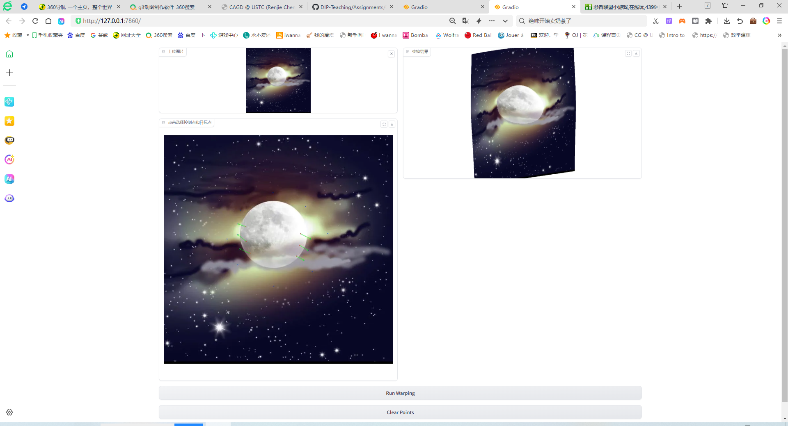

## Implementation of Image Geometric Transformation

This repository is TianYu Li's implementation of Assignment_01 of DIP. 



## Requirements

To install requirements:

```setup
python -m pip install -r requirements.txt
```


## Running

To run basic transformation, run:

```basic
python basic_transform.py
```

To run point guided deformation, run:

```point
python point_guided_deformation.py
```

## Results
### Basic Transformation


### Point Guided Deformation:


## Acknowledgement

>📋 Thanks for the algorithms proposed by [Paper: Image Warping by Radial Basis Functions](https://www.sci.utah.edu/~gerig/CS6640-F2010/Project3/Arad-1995.pdf).
