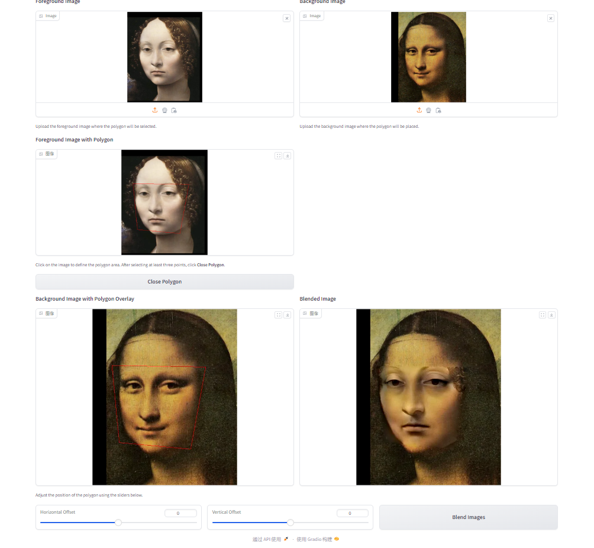

## Implementation of Image Geometric Transformation

This repository is TianYu Li's implementation of Assignment_02(data_possion) of DIP. 

## Requirements

To install requirements:

```setup
python -m pip install -r requirements.txt
```


## Running

To run data_possion, run:

```basic
python data_possion.py
```

## Results
### Basic Transformation



## Acknowledgement

>📋 Thanks for the algorithms proposed by - [Paper: Poisson Image Editing](https://www.cs.jhu.edu/~misha/Fall07/Papers/Perez03.pdf).

