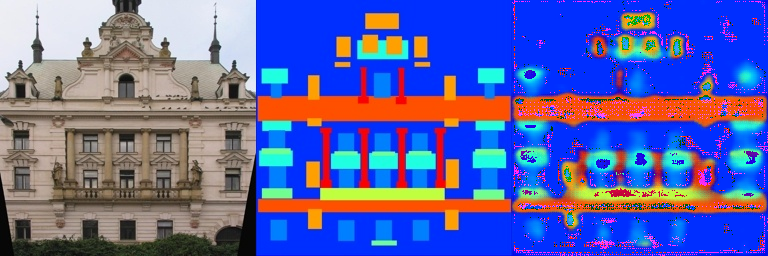

## Implementation of Deep Learning-based DIP

This repository is TianYu Li's implementation of Assignment_02(deep learning-based DIP) of DIP.  

## Requirements

To install requirements:

```setup
pip install -r requirements.txt
```

To download datasets,run:

```bash
bash download_facades_dataset.sh
```

## Training

To train the model, run:

```train
python train.py
```

## Pre-trained Models

Download pix2pix_model_epoch_800.pth in modal 1 and 2:

## Results

Our model achieves the following performance on :

### [Facades Dataset]((https://cmp.felk.cvut.cz/~tylecr1/facade/))

| Model name         | Training Loss  | Validation Loss |
| ------------------ |---------------- | -------------- |
| model 1  |     0.5         |      0.6       |

Train result:


Validation result:


| Model name         | Training Loss  | Validation Loss |
| ------------------ |---------------- | -------------- |
| model 2  |     0.1         |      0.4       |

Train result:



Validation result:


## Acknowledgement

>📋 Thanks for the algorithms proposed by [Paper: Fully Convolutional Networks for Semantic Segmentation](https://arxiv.org/abs/1411.4038).
