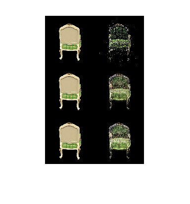

# Assignment 4 - Implement Simplified 3D Gaussian Splatting

This repository is TianYu Li's implementation of Assignment_04(3DGS） of DIP.

### Resources:
- [Paper: 3D Gaussian Splatting](https://repo-sam.inria.fr/fungraph/3d-gaussian-splatting/)
- [3DGS Official Implementation](https://github.com/graphdeco-inria/gaussian-splatting)
- [Colmap for Structure-from-Motion](https://colmap.github.io/index.html)

---

### Step 1. Structure-from-Motion
Run:

```
python debug_mvs_by_projecting_pts.py --data_dir data/chair
```

To get a sparse result for rendering the whole image.

### Step 2. A Simplified 3D Gaussian Splatting
Expand each point to a 3D Gaussian to make it cover more 3D space.

#### 2.1 3D Gaussians Initialization
Refer to the [original paper](https://repo-sam.inria.fr/fungraph/3d-gaussian-splatting/3d_gaussian_splatting_low.pdf). For converting 3D points to 3D Gaussians, we need to define the covariance matrix for each point; the initial Gaussians' centers are just the points. According to equation (6), for defining covariance, we define a scaling matrix S and a rotation matrix R. Since we need to use the 3D Gaussians for volume rendering, we also need the opacity attribute and the color attribute for each Gaussian. The volume rendering process is formulated with equations (1), (2), (3). [The code here](gaussian_model.py#L32) contains functions to initialize these attributes as optimizable parameters. [The filled code here](gaussian_model.py#L103) is to calculate RS(RS)^T and is used to compute the 3D Covariance matrix from the R (for rotation) and the S(scaling parameters).

#### 2.2 Project 3D Gaussians to Obtain 2D Gaussians
According to equation (5), we need to project the 3D Gaussians to the image space by transforming with the world to camera transformation *_W_* and the Jacobian matrix *_J_* of the projection transformation. [the filled code here](gaussian_renderer.py#L26) is for computing the projection.

#### 2.3 Compute the Gaussian Values
We need to compute 2D Gaussians for volume rendering. A 2D Gaussian is represented by:

$$
  f(\mathbf{x}; \boldsymbol{\mu}\_{i}, \boldsymbol{\Sigma}\_{i}) = \frac{1}{2 \pi \sqrt{ | \boldsymbol{\Sigma}\_{i} |}} \exp \left ( {-\frac{1}{2}} (\mathbf{x} - \boldsymbol{\mu}\_{i})^T \boldsymbol{\Sigma}\_{i}^{-1} (\mathbf{x} - \boldsymbol{\mu}\_{i}) \right ) = \frac{1}{2 \pi \sqrt{ | \boldsymbol{\Sigma}\_{i} |}} \exp \left ( P_{(\mathbf{x}, i)} \right )
$$

Here, $\mathbf{x}$ is a 2D vector representing the pixel location, $\boldsymbol{\mu}$ represents a 2D vector representing the mean of the $i$-th 2D Gaussian, and $\boldsymbol{\Sigma}$ represents the covariance of the 2D Gaussian. The exponent part $P_{(\mathbf{x}, i)}$ is:

$$
  P_{(\mathbf{x}, i)} = {-\frac{1}{2}} (\mathbf{x} - \boldsymbol{\mu}\_{i})^T \mathbf{\Sigma}\_{i}^{-1} (\mathbf{x} - \boldsymbol{\mu}\_{i})
$$

 [the filled code here](gaussian_renderer.py#L61) is for computing the Gaussian values.

#### 2.4 Volume Rendering (α-blending)
According to equations (1-3), using these `N` ordered 2D Gaussians, we can compute their alpha and transmittance values at each pixel location in an image.

The alpha value of a 2D Gaussian $i$ at a single pixel location $\mathbf{x}$ can be calculated using:


$$
  \alpha_{(\mathbf{x}, i)} = o_i*f(\mathbf{x}; \boldsymbol{\mu}\_{i}, \boldsymbol{\Sigma}\_{i})
$$


Here, $o_i$ is the opacity of each Gaussian, which is a learnable parameter.

Given `N` ordered 2D Gaussians, the transmittance value of a 2D Gaussian $i$ at a single pixel location $\mathbf{x}$ can be calculated using:

$$
  T_{(\mathbf{x}, i)} = \prod_{j \lt i} (1 - \alpha_{(\mathbf{x}, j)})
$$

 [the code here](gaussian_renderer.py#L83) is for final rendering computation.

After implementation, run:
```
python train.py --colmap_dir data/chair --checkpoint_dir data/chair/checkpoints
```

### Compare with the original 3DGS Implementation
Since we use a pure PyTorch implementation, the training speed and GPU memory usage are far from satisfactory. Also, we do not implement some crucial parts like adaptive Gaussian densification scheme. Run the [original 3DGS implementation](https://github.com/graphdeco-inria/gaussian-splatting) with the same dataset to compare the results.

### Install colmap and pytorch3d

To install colmap:

```setup
pip install colmap -c conda-forge
```

To install pytorch3d:

```setup
git clone https://github.com/facebookresearch/pytorch3d.git
cd pytorch3d && pip install -e .
```

### Results
Part of the results is as follows：




the 1st line for the sparse result,2nd for the training result when epoch = 100 and 3rd for the training result when epoch = 200


